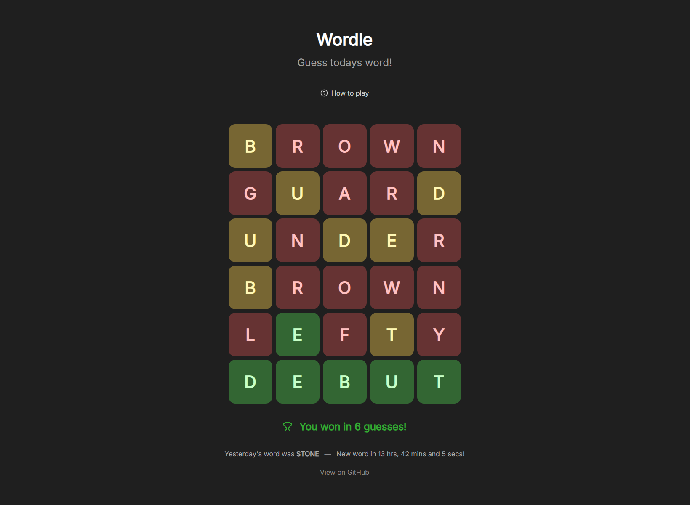

# Wordle

A simple clone of the popular wordle game!

# How does this work:

- [create-react-app](https://create-react-app.dev/) as a base!
- [Lucide](https://lucide.dev/) for the icons!
- [react-confetti-boom](https://github.com/almond-bongbong/react-confetti-boom) for the confetti 😁

Every day at 12 AM (00:00) UCT a github action is run to pick a new word from the wordlist!  
This approach has a downside: you can easily look at the wordlist and today's solution. But this makes it possible to run this on a simple static file host. (except for the action)

# Development

1. Clone the repo
2. Run `npm install`
3. Run `npm run start`

# License

GNU General Public License v3.0
